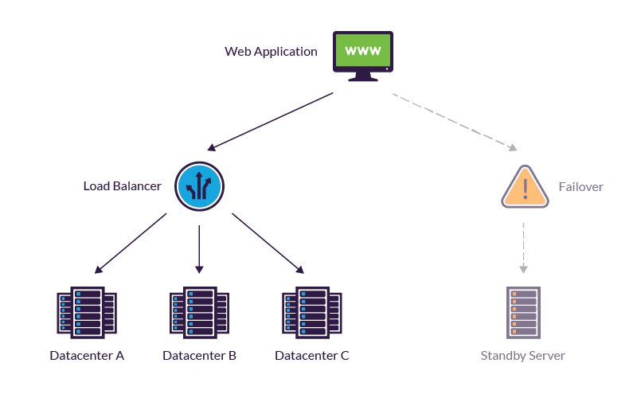
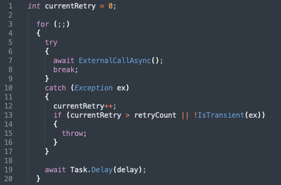
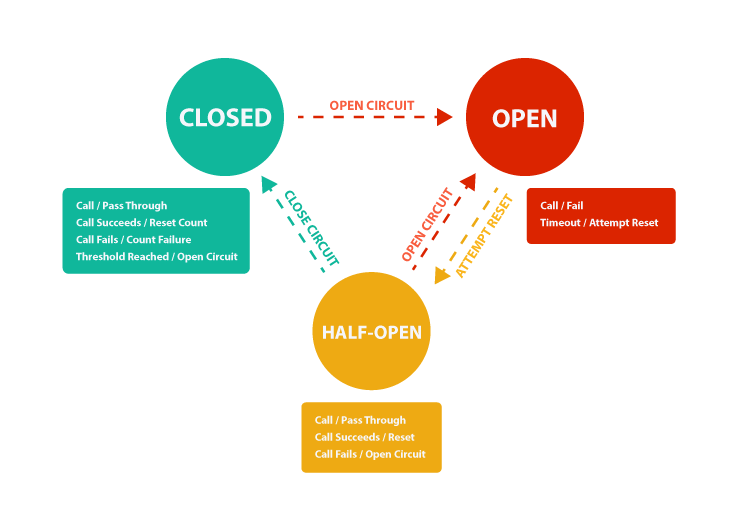
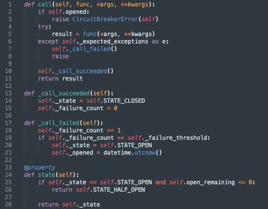
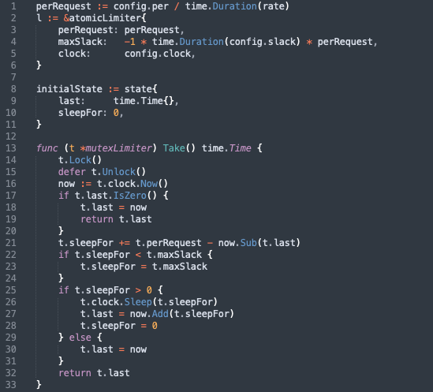
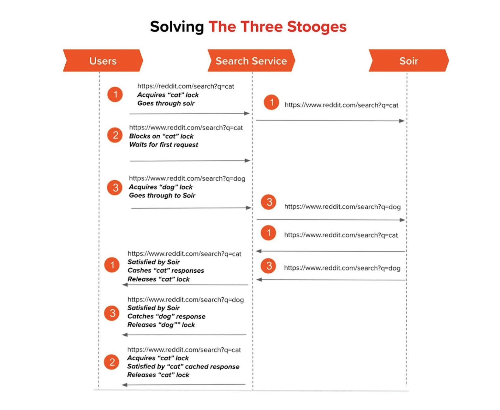
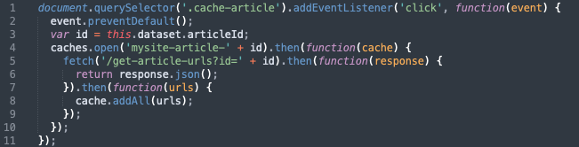

# What are reliability and resilience

* Reliability is the degree to which a product or service conforms to its
specifications when in use, even in the case of failures.
* Resiliency is the ability of a cloud-based service to withstand certain types of failure and yet remain functional from the customer perspective
* Your end goal is to achieve reliability in your software and you're doing that through resiliency

--------------------

# Core design principles

* Design for Resilience
* Design for data integrity
	* don't lose customer's data, replicate it to avoid hardware/software failure
* Design for recoverability
	* expect failures to happen, service must be recoverable

--------------------

# The 8 fallacies

Exact origin is unknown, around '94; there were originally 7 of them.
Last one was added in '97. While internet and software development changed a lot,
the fallacies are still actual.

--------------------

## The network is reliable

* accept and treat failure as a matter of course
* design your system so that it’s able to mitigate failures that will inevitably occur, and continue to operate as expected
* system to be fault-tolerant and highly redundant.

--------------------

## Latency is zero

* just on local :)
* you need to consider:
	* caching
	* maybe event-driven protocols or other async communications
	* server performance

--------------------

## Bandwidth is infinite

* network congestions
	* poor network performance and failures
* bottlenecks and queuing delays
* packet loss

* Possible solutions:
	* multiplexing: HTTP2, HTTP3, websockets
	* monitoring
	* light data formats and compression

--------------------

## The network is secure

* NEVER
* security mindset
* threat modeling

--------------------

### Topology doesn't change

### There is one administrator

### Transport cost is zero

### The network is homogeneous

--------------------

# Some Generic Patterns

--------------------

## Retry

* almost always it's a good pattern to retry
* try to filter out known errors to stay with trensient errors only

--------------------

## Timeouts

* **Always** have timeouts. Say it after me: **always**...
* Timeouts have to be calculated as a mix between SLA's and service load testing
in this order 

--------------------

## Circuit Breaker

* monitors failures for remote calls
* when a treshold is reached, use an alternative flow

--------------------

--------------------

## API throttling - rate limiting

* return 429 when too many requests
* implement retry and circuit breaker in the client

--------------------

## Caching

* Cache poisoning
* Sometimes sacrificing consistency
* Can be used for performance and resilience

--------------------

# Chaos Engineering

* Chaos Engineering is the discipline of experimenting on a system in order to build confidence in the system’s capability to withstand turbulent conditions in production.
https://principlesofchaos.org

* Chaos Monkey https://github.com/Netflix/chaosmonkey
* Litmus https://github.com/litmuschaos/litmus

--------------------

# Reddit's three stooges problem

* dogpile effect or cache stampede
* https://www.reddit.com/r/RedditEng/comments/obqtfm/solving_the_three_stooges_problem

--------------------

--------------------

# For frontend?

* many of the above patterns can and should be used as well (retries and timeouts)
* https://developers.google.com/web/ilt/pwa/caching-files-with-service-worker

--------------------

# Useful stuff

### Books

* Building Microservices Applications on Azure - https://ebook.bogdan.sh/read/82/epub
* Building Microservices - Sam Newman

### Papers and Articles

* https://register.mitre.org/sr/papers1/DesigningResilientSystems.pdf
* https://www.getambassador.io/learn/service-mesh/resilience-for-distributed-systems/
* https://ably.com/blog/engineering-dependability-and-fault-tolerance-in-a-distributed-system
* https://ably.com/blog/8-fallacies-of-distributed-computing

--------------------

* https://docs.microsoft.com/en-us/dotnet/architecture/microservices/architect-microservice-container-applications/resilient-high-availability-microservices
* https://medium.com/swlh/a-design-analysis-of-cloud-based-microservices-architecture-at-netflix-98836b2da45f
* https://levelup.gitconnected.com/how-to-design-a-system-to-scale-to-your-first-100-million-users-4450a2f9703d
* https://medium.com/capital-one-tech/10-microservices-best-practices-for-the-optimal-architecture-design-capital-one-de16abf2a232

### Other cool stuff

* https://github.com/upgundecha/howtheysre
	* https://sre.google/resources/#practicesandprocesses
	* https://www.usenix.org/conference/srecon19emea/presentation/stenning
* https://alexpareto.com/2020/06/15/thundering-herds.html

--------------------

# Q si cu A